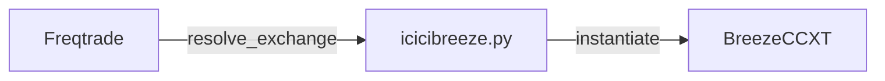
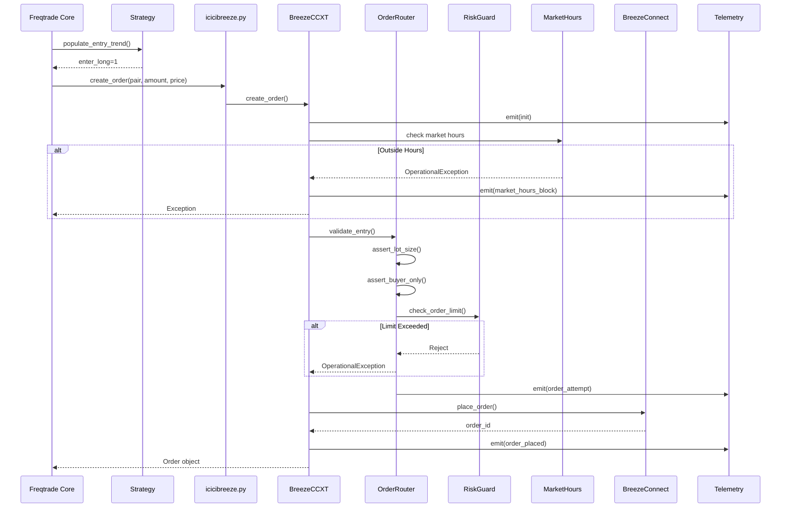
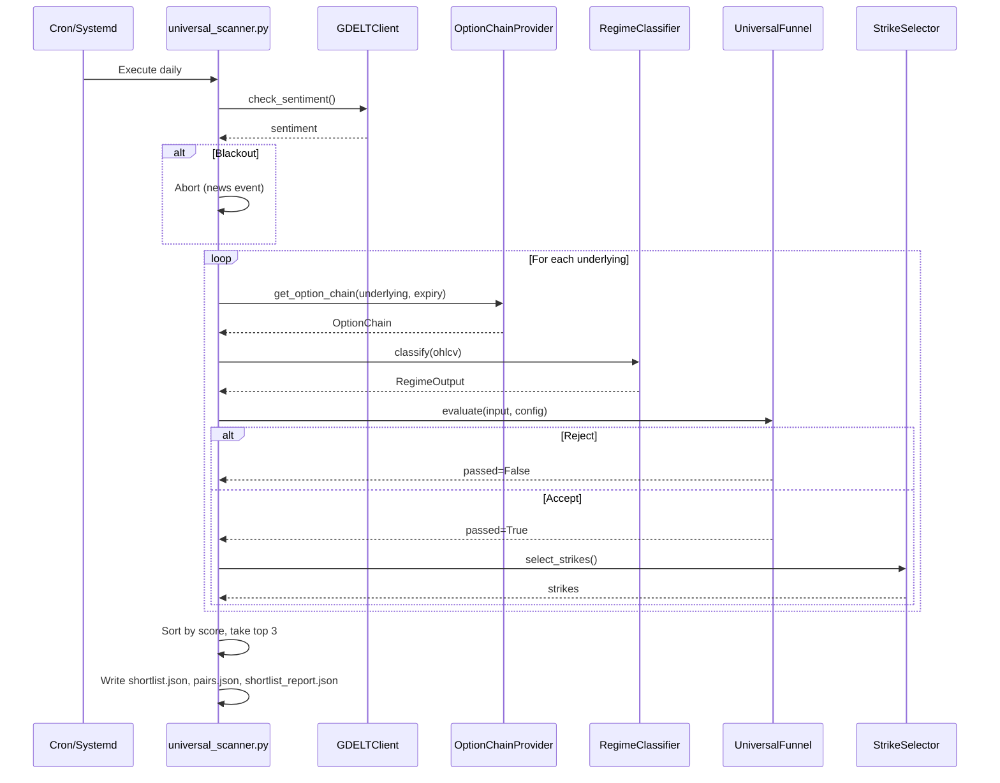

# ICICI Breeze Freqtrade Integration - Architecture Documentation

This document describes the **user-created components** (not part of freqtrade core) for integrating ICICI Breeze with Freqtrade.

---

## Architecture Overview

```mermaid
graph TB
    %% Freqtrade Core (read-only)
    FT[Freqtrade Core]
    EXCH[freqtrade/exchange/exchange.py]
    PERSIST[freqtrade/persistence]
    RPC[freqtrade/rpc]
    
    %% User-Created Exchange Integration
    ICICI[freqtrade/exchange/icicibreeze.py<br/>User Exchange Wrapper]
    BREEZE[adapters/ccxt_shim/breeze_ccxt.py<br/>CCXT-Compatible Adapter]
    SDK[BreezeConnect SDK]
    
    %% Adapters Layer
    SECMASTER[adapters/ccxt_shim/security_master.py]
    ROUTER[adapters/ccxt_shim/order_router.py]
    RISK[adapters/ccxt_shim/risk_guard.py]
    RATE[adapters/ccxt_shim/rate_limiter.py]
    HOURS[adapters/ccxt_shim/market_hours.py]
    PAPER[adapters/ccxt_shim/paper_ledger.py]
    DEGRADE[adapters/ccxt_shim/degraded_mode.py]
    
    %% Telemetry
    TELEMETRY[adapters/telemetry/udp_bus.py]
    
    %% Modules (Domain Logic)
    OPTCHAIN[adapters/option_chain/breeze_option_chain_provider.py]
    REGIME[modules/regime/classifier.py]
    STRIKE[modules/strike_selector/selector.py]
    FUNNEL[modules/universal_funnel/funnel.py]
    NEWS[adapters/news/gdelt_client.py]
    VALUATION[modules/options_valuation]
    
    %% User Strategy
    STRATEGY[user_data/strategies/IndiaOptionsAutoStrategy.py]
    
    %% Scripts
    SCANNER[scripts/universal_scanner.py]
    GATES[scripts/gates/*.sh]
    RUNNER[scripts/run_debug_bundle.sh]
    
    %% Connections
    FT --> EXCH
    EXCH --> ICICI
    ICICI --> BREEZE
    BREEZE --> SDK
    
    BREEZE --> SECMASTER
    BREEZE --> ROUTER
    BREEZE --> RISK
    BREEZE --> RATE
    BREEZE --> HOURS
    BREEZE --> PAPER
    BREEZE --> DEGRADE
    BREEZE --> TELEMETRY
    
    ROUTER --> RISK
    ROUTER --> TELEMETRY
    
    FT --> STRATEGY
    STRATEGY --> ICICI
    
    SCANNER --> OPTCHAIN
    SCANNER --> REGIME
    SCANNER --> STRIKE
    SCANNER --> FUNNEL
    SCANNER --> NEWS
    OPTCHAIN --> SDK
    
    FUNNEL --> REGIME
    FUNNEL --> VALUATION
    
    style FT fill:#f9f,stroke:#333,stroke-width:2px
    style EXCH fill:#f9f,stroke:#333
    style PERSIST fill:#f9f,stroke:#333
    style RPC fill:#f9f,stroke:#333
    
    style BREEZE fill:#bbf,stroke:#333,stroke-width:2px
    style ICICI fill:#bbf,stroke:#333,stroke-width:2px
    
    style SECMASTER fill:#bfb,stroke:#333
    style ROUTER fill:#bfb,stroke:#333
    style RISK fill:#bfb,stroke:#333
    style RATE fill:#bfb,stroke:#333
    style HOURS fill:#bfb,stroke:#333
    style PAPER fill:#bfb,stroke:#333
    style DEGRADE fill:#bfb,stroke:#333
    
    style TELEMETRY fill:#fbb,stroke:#333
    
    style REGIME fill:#ffb,stroke:#333
    style STRIKE fill:#ffb,stroke:#333
    style FUNNEL fill:#ffb,stroke:#333
    style VALUATION fill:#ffb,stroke:#333
```



**Legend**:

- 🔴 **Pink**: Freqtrade Core (read-only, no modifications)
- 🔵 **Blue**: Exchange Integration Layer
- 🟢 **Green**: Adapter Components (Infrastructure)
- 🟡 **Yellow**: Domain Modules (Business Logic)
- 🔴 **Red**: Telemetry & Observability

---

## Component Inventory

### 1. Exchange Integration (`freqtrade/exchange/` + `adapters/ccxt_shim/`)

#### `freqtrade/exchange/icicibreeze.py`

**Objective**: Freqtrade exchange wrapper that delegates to BreezeCCXT adapter

**Purpose**: Minimal glue layer to register ICICI Breeze as a freqtrade exchange

**Fan-in**: Freqtrade exchange resolver  
**Fan-out**: `adapters/ccxt_shim/breeze_ccxt.py`



#### `adapters/ccxt_shim/breeze_ccxt.py`

**Objective**: CCXT-compatible adapter for ICICI Breeze SDK

**Purpose**: Translate CCXT methods (`fetch_ohlcv`, `create_order`, `fetch_balance`) to Breeze SDK calls

**Fan-in**: `icicibreeze.py`, test scripts, scanner  
**Fan-out**: BreezeConnect SDK, SecurityMaster, OrderRouter, RiskGuard, RateLimiter, MarketHours, DegradedMode, PaperLedger, Telemetry

**Key Methods**:

- `fetch_markets()` - Load from SecurityMaster
- `fetch_ohlcv()` - Historical data via Breeze
- `create_order()` - Route through OrderRouter with guards
- `fetch_balance()` - Real-time account balance
- `fetch_order()`, `cancel_order()` - Order lifecycle management

---

### 2. Adapter Components (`adapters/ccxt_shim/`)

#### `security_master.py`

**Objective**: Parse and cache ICICI SecurityMaster files

**Purpose**: Map freqtrade pair names to Breeze tokens and contract specs

**Fan-in**: `breeze_ccxt.py`  
**Fan-out**: FONSEScripMaster.txt, NSEScripMaster.txt (files)

**Key Responsibility**: Contract resolution for options/futures

#### `order_router.py`

**Objective**: Enforce trading policies at order placement

**Purpose**: Lot size validation, buyer-only policy, modification quotas

**Fan-in**: `breeze_ccxt.create_order()`  
**Fan-out**: Telemetry

**Policies**:

- Lot size enforcement (must be multiple of contract lot)
- Buyer-only (no shorts; sells only allowed for exits)
- Modification rate limits (max 3 mods, min 2s spacing)

#### `risk_guard.py`

**Objective**: Position and order count limits

**Purpose**: Prevent runaway trading

**Fan-in**: `breeze_ccxt.create_order()`  
**Fan-out**: Persistent state file (`user_data/cache/risk_guard_state.json`)

**Limits**:

- Max open orders: 10 (default)
- Max open positions: 10 (default)

#### `rate_limiter.py`

**Objective**: API call throttling

**Purpose**: Respect Breeze API rate limits (100 calls/minute default)

**Fan-in**: `breeze_ccxt.*` (all API calls)  
**Fan-out**: None (sleep-based limiter)

**Behavior**: Tracks tokens, sleeps if rate exceeded

#### `market_hours.py`

**Objective**: Block trading outside market hours

**Purpose**: Prevent rejected orders during non-trading hours

**Fan-in**: `breeze_ccxt.create_order()`  
**Fan-out**: Telemetry

**Hours**: 9:15 AM - 3:30 PM IST (configurable)

#### `degraded_mode.py`

**Objective**: Circuit breaker for persistent API failures

**Purpose**: Temporarily block trading after repeated errors

**Fan-in**: `breeze_ccxt` (on exceptions)  
**Fan-out**: Telemetry

**Trigger**: 5 consecutive API failures → 5-minute cooldown

#### `paper_ledger.py`

**Objective**: Paper trading simulation

**Purpose**: Forward-test strategies with fake fills

**Fan-in**: `breeze_ccxt.create_order()` (when paper mode enabled)  
**Fan-out**: Ledger file (`user_data/cache/paper_ledger.json`)

**Behavior**: Synthetic fills with configurable slippage and fees

---

### 3. Telemetry (`adapters/telemetry/`)

#### `udp_bus.py`

**Objective**: UDP telemetry emission for debugging

**Purpose**: Non-blocking event logging to localhost UDP ports

**Fan-in**: All components via `emit(event, payload)`  
**Fan-out**: UDP ports 17100-17103 (Breeze, Engine, Orders, UI)

**Control**: `FT_DEBUG` environment variable (0=off, 1=keypoints, 2=detailed)

#### `schema.py`

**Objective**: Telemetry event schema

**Purpose**: Standard JSON event format

**Fields**: layer, event, severity, timestamp, payload, run_id

---

### 4. Domain Modules (`modules/`)

#### `modules/regime/classifier.py`

**Objective**: Market regime detection

**Purpose**: Classify underlying as trending/ranging/volatile

**Fan-in**: `universal_scanner.py`  
**Fan-out**: None

**Inputs**: OHLCV DataFrame  
**Outputs**: RegimeOutput (regime, confidence)

#### `modules/strike_selector/selector.py`

**Objective**: Option strike selection

**Purpose**: Pick optimal strikes based on delta/moneyness

**Fan-in**: `universal_scanner.py`  
**Fan-out**: None

**Logic**: ATM ± N strikes based on liquidity and risk preference

#### `modules/universal_funnel/funnel.py`

**Objective**: Multi-stage candidate filtering

**Purpose**: Reject unpromising underlyings early

**Fan-in**: `universal_scanner.py`  
**Fan-out**: `regime/classifier.py`, `options_valuation/`

**Stages**:

1. Reject if blacklisted
2. Reject if bad OHLCV data
3. Reject if bad regime
4. Reject if low liquidity
5. Accept top N scored candidates

#### `modules/options_valuation/`

**Objective**: IV and Greeks calculation

**Purpose**: Value options using Black-Scholes

**Fan-in**: `universal_funnel/funnel.py`  
**Fan-out**: None

**Functions**: `calculate_iv()`, `calculate_greeks()`

---

### 5. Adapters (External APIs)

#### `adapters/option_chain/breeze_option_chain_provider.py`

**Objective**: Fetch option chain from Breeze

**Purpose**: Real-time option quotes

**Fan-in**: `universal_scanner.py`  
**Fan-out**: BreezeConnect SDK

#### `adapters/news/gdelt_client.py`

**Objective**: News sentiment via GDELT

**Purpose**: Blackout flag during high-impact events

**Fan-in**: `universal_scanner.py`  
**Fan-out**: GDELT HTTP API

---

### 6. Scripts

#### `scripts/universal_scanner.py`

**Objective**: Scheduled scanner for option opportunities

**Purpose**: Generate daily shortlist of tradeable option pairs

**Fan-in**: Cron/systemd timer  
**Fan-out**: Modules (regime, strike, funnel), adapters (option_chain, news)

**Output**: `user_data/generated/p51/shortlist.json`, `pairs.json`, `shortlist_report.json`

#### `scripts/run_debug_bundle.sh`

**Objective**: Diagnostic bundle creation

**Purpose**: Capture logs, telemetry, artifacts for debugging

**Fan-in**: Manual/scheduled execution  
**Fan-out**: Tar bundle with terminal logs, UDP telemetry, metadata

**Output**: `user_data/generated/ft_debug_bundle_*.tar.gz`

#### `scripts/gates/*.sh`

**Objective**: Acceptance test gates

**Purpose**: Validate system behavior before deployment

**Fan-in**: `scripts/accept_all.sh`  
**Fan-out**: Freqtrade commands, test data

---

### 7. User Strategy

#### `user_data/strategies/IndiaOptionsAutoStrategy.py`

**Objective**: Options trading strategy

**Purpose**: Trade CE/PE based on underlying cash indicators

**Fan-in**: Freqtrade strategy resolver  
**Fan-out**: `adapters/ccxt_shim/instrument.py` (for pair parsing)

**Logic**:

- Fetch underlying cash indicators (EMA, RSI)
- Generate signals for CE (bull) or PE (bear)
- Respect time windows (9:45 AM - 2:30 PM IST)
- Force exit after 2:30 PM

---

## Data Flow Diagrams

### Trade Execution Flow



### Scanner Flow



---

## File Organization

```
freqtrade-icicibreeze/
├── freqtrade/
│   └── exchange/
│       └── icicibreeze.py              [User-created wrapper]
│
├── adapters/                            [User-created adapters]
│   ├── ccxt_shim/
│   │   ├── breeze_ccxt.py ⭐          [Main CCXT adapter]
│   │   ├── security_master.py
│   │   ├── order_router.py
│   │   ├── risk_guard.py
│   │   ├── rate_limiter.py
│   │   ├── market_hours.py
│   │   ├── degraded_mode.py
│   │   ├── paper_ledger.py
│   │   ├── instrument.py               [Pair naming utils]
│   │   └── errors.py                   [Custom exceptions]
│   ├── telemetry/
│   │   ├── udp_bus.py
│   │   └── schema.py
│   ├── option_chain/
│   │   └── breeze_option_chain_provider.py
│   ├── news/
│   │   └── gdelt_client.py
│   └── time/
│       └── fake_clock.py               [Test utility]
│
├── modules/                             [User-created domain logic]
│   ├── regime/
│   │   └── classifier.py
│   ├── strike_selector/
│   │   └── selector.py
│   ├── universal_funnel/
│   │   ├── funnel.py
│   │   └── config.py
│   ├── options_valuation/
│   │   ├── __init__.py
│   │   └── greeks.py
│   └── news_filter/
│       └── blackout_flag.py
│
├── scripts/                             [User-created scripts]
│   ├── universal_scanner.py ⭐
│   ├── run_debug_bundle.sh ⭐
│   ├── accept_all.sh
│   ├── gates/
│   │   ├── p*.sh                       [60+ test gates]
│   │   └── common.sh
│   ├── ops/
│   │   └── sync_security_master.py
│   └── freqtrade--ui                   [Webserver launcher]
│
├── user_data/
│   ├── strategies/
│   │   └── IndiaOptionsAutoStrategy.py [User strategy]
│   ├── risk_guardrails/
│   │   └── guardrails.py
│   └── generated/                      [Runtime artifacts]
│       ├── p51/                        [Scanner output]
│       └── ft_debug_bundle_*/          [Debug bundles]
│
├── utils/
│   └── telemetry/                      [Legacy telemetry utils]
│
└── docs/
    ├── PHASE_P*.md                     [Phase documentation]
    ├── ICICI_MAPPING.md
    ├── PAIR_NAMING.md
    └── OPS_RUNBOOK.md
```

---

## Key Design Principles

### 1. **Minimal Core Modifications**

- Only one file modified in freqtrade core: `freqtrade/exchange/icicibreeze.py`
- All other logic in `adapters/` and `modules/`
- Easier to upgrade freqtrade without conflicts

### 2. **CCXT Compatibility**

- `BreezeCCXT` implements CCXT interface
- Freqtrade sees ICICI Breeze as any other exchange
- Reduces integration surface area

### 3. **Layered Guards**

- OrderRouter → RiskGuard → MarketHours → Rate Limiter
- Each guard has single responsibility
- Fail-safe: block on uncertainty

### 4. **Observable**

- UDP telemetry for runtime debugging
- Exit codes captured in debug bundles
- Acceptance gates validate behavior

### 5. **Testable**

- Mock mode bypasses Breeze SDK
- FakeClock for deterministic time tests
- 60+ acceptance gates cover real scenarios

---

## Environment Variables

| Variable | Purpose | Default |
|----------|---------|---------|
| `BREEZE_API_KEY` | Breeze API key | Required |
| `BREEZE_API_SECRET` | Breeze API secret | Required |
| `BREEZE_SESSION_TOKEN` | Breeze session token | Required |
| `BREEZE_MOCK` | Enable mock mode (1=mock) | `0` |
| `FT_DEBUG` | Telemetry level (0=off, 1=keypoints, 2=detailed) | `0` |
| `FT_TELEMETRY_BIND` | UDP bind address | `127.0.0.1` |

---

## Critical Paths

### Path 1: Place Order

```
Freqtrade → icicibreeze.py → BreezeCCXT → MarketHours → OrderRouter → 
RiskGuard → RateLimiter → BreezeConnect SDK → Exchange → Order Placed
```

### Path 2: Generate Shortlist

```
Cron → universal_scanner.py → GDELTClient (news check) → 
For each underlying:
  OptionChainProvider → RegimeClassifier → UniversalFunnel → 
  StrikeSelector → shortlist.json
```

### Path 3: Debug Bundle

```
run_debug_bundle.sh → Start UDP listeners → 
Run debug1 (FT_DEBUG=1, -v) → 
Run debug2 (FT_DEBUG=2, -vv) → 
Capture artifacts → Create tar.gz
```

---

## Next Steps

For detailed information on specific components:

- **Exchange Integration**: See `docs/ICICI_MAPPING.md`
- **Pair Naming**: See `docs/PAIR_NAMING.md`
- **Operations**: See `docs/OPS_RUNBOOK.md`
- **Phase Docs**: See `docs/PHASE_P*.md` for gate-specific details
- **Risk**: See `docs/RISK_GUARD_SCHEMA.md`
