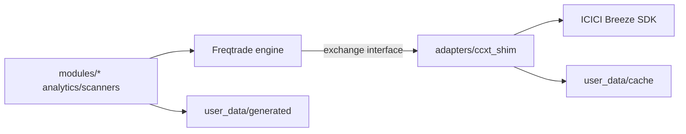
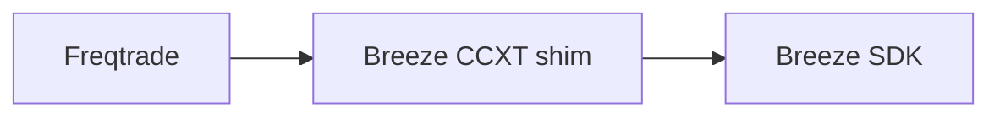
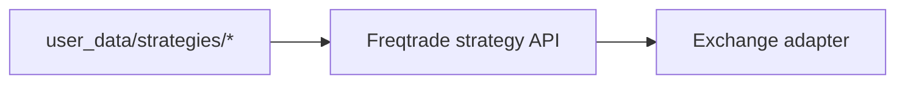

# Architecture diagrams

## A) Freqtrade + Breeze adapter + modules

```mermaid
flowchart LR
  FT[Freqtrade engine] -->|exchange interface| SHIM[adapters/ccxt_shim]
  SHIM --> SDK[ICICI Breeze SDK]
  MOD[modules/* analytics/scanners] --> FT
  SHIM --> C1[user_data/cache]
  MOD --> C2[user_data/generated]
```

## B) Direct adapter route

```mermaid
flowchart LR
  FT[Freqtrade] --> SHIM[Breeze CCXT shim]
  SHIM --> SDK[Breeze SDK]
```

## C) Strategy interaction

```mermaid
flowchart LR
  STRAT[user_data/strategies/*] --> FT[Freqtrade strategy API]
  FT --> SHIM[Exchange adapter]
```
